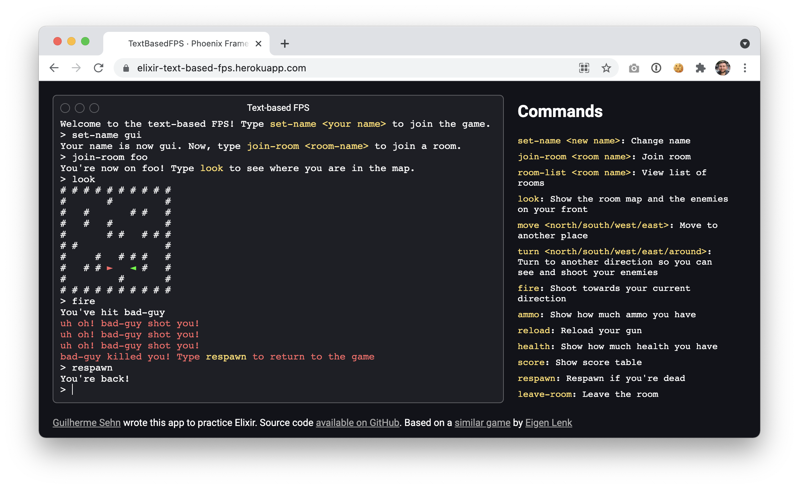

# elixir-text-based-fps

Online multiplayer text-based FPS game using Elixir + Phoenix. The game is live at [elixir-text-based-fps.fly.dev](https://elixir-text-based-fps.fly.dev/)



[Original game](http://eigen.pri.ee/shooter/) and map made by [Eigen Lenk](http://eigen.pri.ee/).

You can also see a node.js version of this game I made a few years ago at https://github.com/guisehn/text-based-fps

## How to run locally

### Running as a web server

To start your Phoenix server:

  * Install dependencies with `mix deps.get`
  * Install Node.js dependencies with `npm install` inside the `assets` directory
  * Start Phoenix endpoint with `mix phx.server`

Now you can visit [`localhost:4000`](http://localhost:4000) from your browser.

### Running in the terminal

It can also be played directly in the terminal using OTP distribution.

  * Install dependencies with `mix deps.get`
  * Ensure that the [epmd daemon](https://erlang.org/doc/man/epmd.html) is active by running `epmd -daemon`.
  * Run `mix cli.server` to start the server.
  * Run `mix cli.client` in another Terminal session to join the server. You can open multiple sessions for multiple players.

Communicating between multiple computers:

  * Run `mix cli.server --external --cookie mysecret` to start the server.
  * Run `mix cli.client --server=text-based-fps-server@192.168.0.xx --cookie mysecret` (replace with the server private network IP address).

## Editing the map

The game map is interpreted from the plain text file `priv/map.txt` where:

- `#` represent the walls
- `N`, `S`, `W`, `E` represent the respawn positions where the letters mean the player initial direction (north, south, west or east)

The engine automatically ignores empty lines at the start and end of the map, and also empty spaces after the last wall of the line. You can add a `.` character to circumvent that if you really mean to have those empty spaces.

## Server architecture

The game server is organized using the following process structure:

```
                               Application
                                    |
               +---------------------------------------------+
               |                                             |
        GameState.Players                         GameState.RoomSupervisor
            (agent)                                 (dynamic supervisor)
                                                             |
                                          +------------------+-----------------+
                                          |                  |                 |
                                          |                  |                 |
                                    GameState.Room     GameState.Room    GameState.Room
                                       (agent)            (agent)           (agent)
```

### `GameState.Players`

The `GameState.Players` agent keeps a map of all players connected to the server. Here's an example of its internal state:

```elixir
%{
  "d5556609-0b58-47cd-ae08-7db873fa5ac5" => %TextBasedFPS.Game.Player{
    key: "d5556609-0b58-47cd-ae08-7db873fa5ac5",
    name: "Steve",
    room: "de_dust2",
    last_command_at: ~U[2021-06-05 23:09:37]
  },
  "e01f611e-4a61-4127-ba7b-4ba85ee73e3e" => %TextBasedFPS.Game.Player{
    key: "e01f611e-4a61-4127-ba7b-4ba85ee73e3e",
    name: "John",
    room: "de_dust2",
    last_command_at: ~U[2021-06-05 23:09:24]
  },
  "161cb888-b9d8-44f6-9d5a-3b90f242e511" => %TextBasedFPS.Game.Player{
    key: "161cb888-b9d8-44f6-9d5a-3b90f242e511",
    name: "Bryan",
    room: nil,
    last_command_at: ~U[2021-06-05 23:08:10]
  }
}
```

### `GameState.Room`

In order to play, players have to join a room. Each room has its own process using the `GameState.Room` agent. This guarantees that if a room crashes, players from other rooms are not affected.

The state of the agent is a `Game.Room` struct, containing the list of players on that room with their relevant game information such as score, coordinates, health, ammo, position in the map, etc. The room struct also holds the map of the game, with information like where the walls, empty spaces and game items ,(like ammo and health packs) are located, as well as where are the respawn positions.

Here's the example of a room agent state:

```elixir
%TextBasedFPS.Game.Room{
  name: "de_dust2",
  players: %{
    "d5556609-0b58-47cd-ae08-7db873fa5ac5" => %TextBasedFPS.Game.RoomPlayer{
      ammo: {8, 24},
      coordinates: {8, 5},
      direction: :south,
      health: 100,
      killed: 1,
      kills: 3,
      player_key: "d5556609-0b58-47cd-ae08-7db873fa5ac5"
    },
    "e01f611e-4a61-4127-ba7b-4ba85ee73e3e" => %TextBasedFPS.Game.RoomPlayer{
      ammo: {8, 24},
      coordinates: {5, 1},
      direction: :south,
      health: 100,
      killed: 3,
      kills: 1,
      player_key: "e01f611e-4a61-4127-ba7b-4ba85ee73e3e"
    }
  },
  game_map: %TextBasedFPS.GameMap{
    matrix: [
      [:"#", :"#", :"#", :"#", :"#", :"#", :"#", :"#", :"#", :"#"],
      [
        :"#",
        :" ",
        :" ",
        :" ",
        :"#",
        %TextBasedFPS.GameMap.Objects.Player{player_key: "e01f611e-4a61-4127-ba7b-4ba85ee73e3e"},
        :" ",
        :" ",
        :" ",
        :"#"
      ],
      [:"#", :" ", :"#", :" ", :" ", :" ", :"#", :"#", :" ", :"#"],
      [:"#", :" ", :"#", :" ", :"#", :" ", :" ", :" ", :" ", :"#"],
      [:"#", :" ", :" ", :" ", :"#", :"#", :" ", :"#", :"#", :"#"],
      [
        :"#",
        :"#",
        :" ",
        :" ",
        :" ",
        :" ",
        :" ",
        :" ",
        %TextBasedFPS.GameMap.Objects.Player{player_key: "d5556609-0b58-47cd-ae08-7db873fa5ac5"},
        :"#"
      ],
      [:"#", :" ", :" ", :"#", :" ", :"#", :"#", :"#", :" ", :"#"],
      [:"#", :" ", :"#", :"#", :" ", :" ", :" ", :"#", :" ", :"#"],
      [:"#", :" ", :" ", :" ", :" ", :"#", :" ", :" ", :" ", :"#"],
      [:"#", :"#", :"#", :"#", :"#", :"#", :"#", :"#", :"#", :"#"]
    ],
    respawn_positions: [
      %TextBasedFPS.GameMap.RespawnPosition{coordinates: {1, 1}, direction: :east},
      %TextBasedFPS.GameMap.RespawnPosition{coordinates: {5, 1}, direction: :south},
      %TextBasedFPS.GameMap.RespawnPosition{coordinates: {8, 3}, direction: :north},
      %TextBasedFPS.GameMap.RespawnPosition{coordinates: {3, 4}, direction: :west},
      %TextBasedFPS.GameMap.RespawnPosition{coordinates: {8, 5}, direction: :south},
      %TextBasedFPS.GameMap.RespawnPosition{coordinates: {6, 7}, direction: :west},
      %TextBasedFPS.GameMap.RespawnPosition{coordinates: {1, 8}, direction: :north}
    ]
  }
}
```
