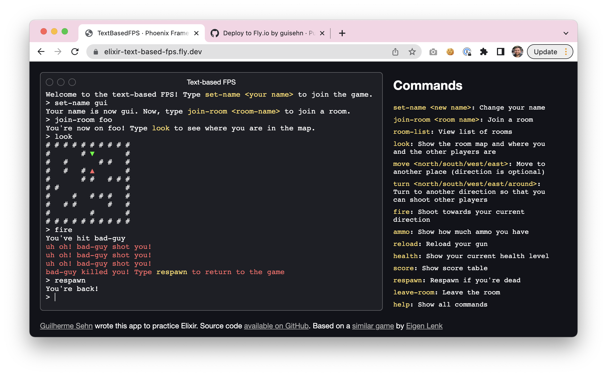

# elixir-text-based-fps

Text-based FPS game made by [Guilherme Sehn](http://www.guisehn.com/) using Elixir + Phoenix. The game is live at [elixir-text-based-fps.herokuapp.com](https://elixir-text-based-fps.herokuapp.com/)



[Original game](http://eigen.pri.ee/shooter/) and map made by [Eigen Lenk](http://eigen.pri.ee/).

You can also see a node.js version of this game I made a few years ago at https://github.com/guisehn/text-based-fps

## How to run locally

### Running the web server

To start your Phoenix server:

  * Install dependencies with `mix deps.get`
  * Install Node.js dependencies with `npm install` inside the `assets` directory
  * Start Phoenix endpoint with `mix phx.server`

Now you can visit [`localhost:4000`](http://localhost:4000) from your browser.

### Running in your terminal

It can also be played in the terminal, controlling one player at a time.

I started the code running it this way to help testing, before I added Phoenix to the project.

  * Install dependencies with `mix deps.get`
  * Run the task `mix cli`

This will start the game with two players: `John` and `Jane` and add both to a room called `spaceship`.

  * You'll start playing as `John`. Enter the game commands such as `look`, `move`, `turn`, etc to play.
  * To switch between players, enter `switch-player 0` and `switch-player 1`.
  * To add a new player, enter `add-player`. You can later switch back to it using `switch-player 2` (each new player increments the counter).
  * To remove the current player, enter `remove-player`, then switch to another player. If you try to run a game command with a removed player, it'll crash.
  * To view the server state, enter `view-state`.

## How to deploy

Click on the button below to deploy to Heroku:

[](https://heroku.com/deploy?template=https://github.com/guisehn/elixir-text-based-fps)

## Editing the map

The game map is interpreted from the plain text file `priv/map.txt` where:

- `#` represent the walls
- `N`, `S`, `W`, `E` represent the respawn positions where the letters mean the player initial direction (north, south, west or east)

The engine automatically ignores empty lines at the start and end of the map, and also empty spaces after the last wall of the line. You can add a `.` character to circumvent that if you really mean to have those empty spaces.

## How the game works

The entire game is a giant `%TextBasedFPS.ServerState` struct. The `IO.inspect` dump below is for a server with two players `John` and `Jane`, and one room `spaceship`.

The server state is stored in an [Agent](https://hexdocs.pm/elixir/1.12/Agent.html) at [/lib/text_based_fps/server_agent.ex](/lib/text_based_fps/server_agent.ex).

The `%TextBasedFPS.ServerState` struct has two members: `players` and `rooms`:

  * `players` is a map containing all players of the server of all rooms. The keys are UUIDs that uniquely identify those players in the server. Each player is a `%TextBasedFPS.Player` struct.

  * `rooms` is a map containing all rooms of the game, and each room is a `%TextBasedFPS.Room` struct. Inside this struct, you'll find the keys: 
  
    * `name`: the name of the room

    * `players`: each player is a `%TextBasedFPS.RoomPlayer` with the room session specific information such as coordinates, direction, ammo, kills and killed, etc.

    * `game_map`: contains a matrix with the current state of the map (including players and objects such as ammo and health packs), and a list of respawn positions

```elixir
%TextBasedFPS.ServerState{
  players: %{
    "2eda2c30-645f-494e-b934-20ed88165a32" => %TextBasedFPS.Player{
      key: "2eda2c30-645f-494e-b934-20ed88165a32",
      last_command_at: ~U[2021-06-04 02:06:15.641489Z],
      name: "John",
      room: "spaceship"
    },
    "7f25325c-3c83-4790-838c-15d5d0e928bf" => %TextBasedFPS.Player{
      key: "7f25325c-3c83-4790-838c-15d5d0e928bf",
      last_command_at: ~U[2021-06-04 02:06:15.645960Z],
      name: "Jane",
      room: "spaceship"
    }
  },
  rooms: %{
    "spaceship" => %TextBasedFPS.Room{
      name: "spaceship",
      players: %{
        "2eda2c30-645f-494e-b934-20ed88165a32" => %TextBasedFPS.RoomPlayer{
          ammo: {8, 24},
          coordinates: {8, 5},
          direction: :south,
          health: 100,
          killed: 0,
          kills: 0,
          player_key: "2eda2c30-645f-494e-b934-20ed88165a32"
        },
        "7f25325c-3c83-4790-838c-15d5d0e928bf" => %TextBasedFPS.RoomPlayer{
          ammo: {8, 24},
          coordinates: {1, 8},
          direction: :north,
          health: 100,
          killed: 0,
          kills: 0,
          player_key: "7f25325c-3c83-4790-838c-15d5d0e928bf"
        }
      },
      game_map: %TextBasedFPS.GameMap{
        matrix: [
          ["#", "#", "#", "#", "#", "#", "#", "#", "#", "#"],
          ["#", " ", " ", " ", "#", " ", " ", " ", " ", "#"],
          ["#", " ", "#", " ", " ", " ", "#", "#", " ", "#"],
          ["#", " ", "#", " ", "#", " ", " ", " ", " ", "#"],
          ["#", " ", " ", " ", "#", "#", " ", "#", "#", "#"],
          [
            "#",
            "#",
            " ",
            " ",
            " ",
            " ",
            " ",
            " ",
            %TextBasedFPS.GameMap.Objects.Player{
              player_key: "2eda2c30-645f-494e-b934-20ed88165a32"
            },
            "#"
          ],
          ["#", " ", " ", "#", " ", "#", "#", "#", " ", "#"],
          ["#", " ", "#", "#", " ", " ", " ", "#", " ", "#"],
          [
            "#",
            %TextBasedFPS.GameMap.Objects.Player{
              player_key: "7f25325c-3c83-4790-838c-15d5d0e928bf"
            },
            " ",
            " ",
            " ",
            "#",
            " ",
            " ",
            " ",
            "#"
          ],
          ["#", "#", "#", "#", "#", "#", "#", "#", "#", "#"]
        ],
        respawn_positions: [
          %TextBasedFPS.GameMap.RespawnPosition{
            coordinates: {1, 1},
            direction: :east
          },
          %TextBasedFPS.GameMap.RespawnPosition{
            coordinates: {5, 1},
            direction: :south
          },
          %TextBasedFPS.GameMap.RespawnPosition{
            coordinates: {8, 3},
            direction: :north
          },
          %TextBasedFPS.GameMap.RespawnPosition{
            coordinates: {3, 4},
            direction: :west
          },
          %TextBasedFPS.GameMap.RespawnPosition{
            coordinates: {8, 5},
            direction: :south
          },
          %TextBasedFPS.GameMap.RespawnPosition{
            coordinates: {6, 7},
            direction: :west
          },
          %TextBasedFPS.GameMap.RespawnPosition{
            coordinates: {1, 8},
            direction: :north
          }
        ]
      }
    }
  }
}
```